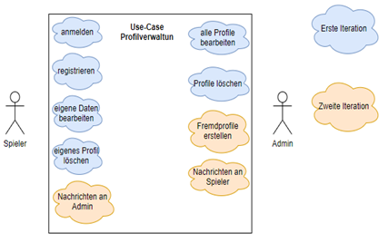
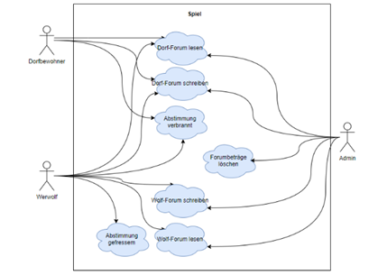
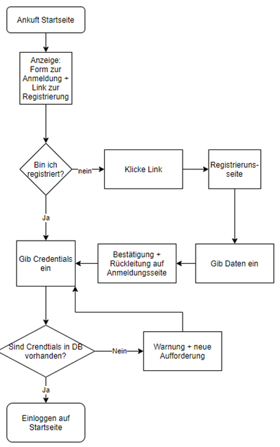
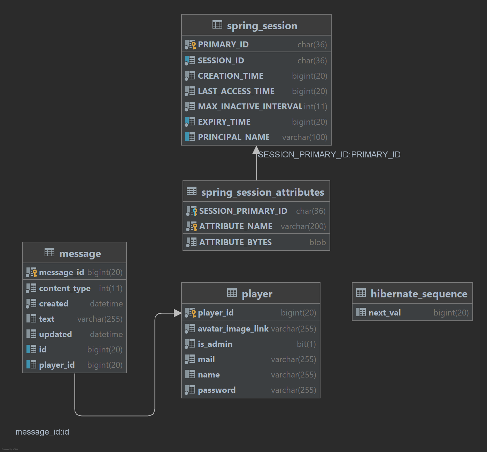
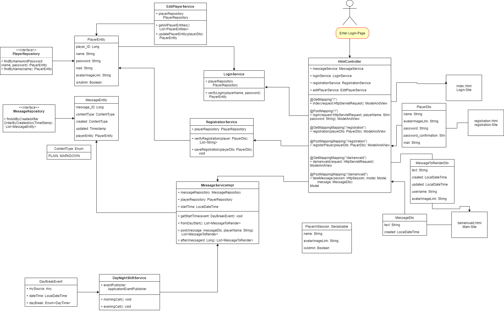
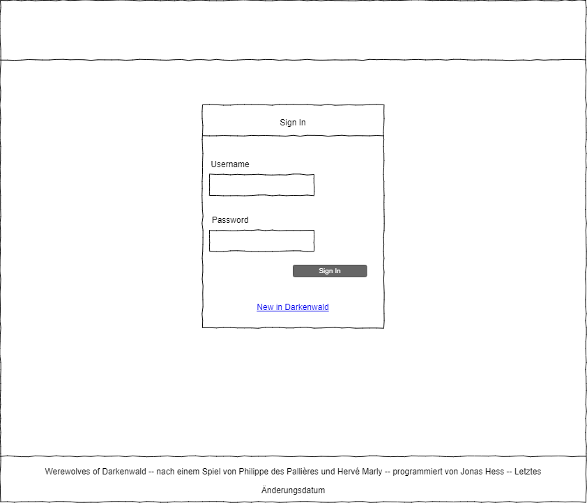
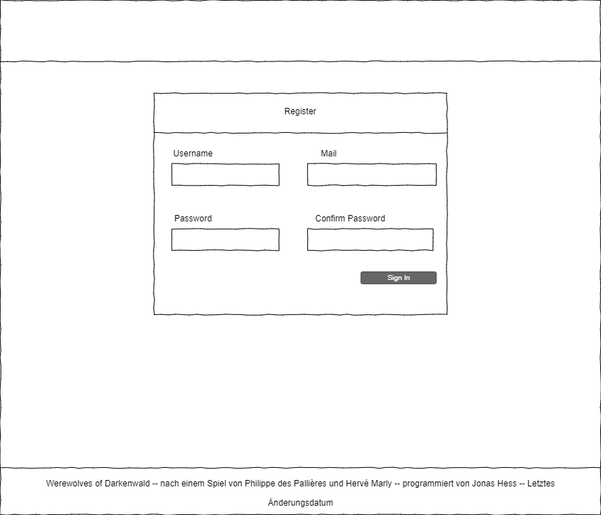
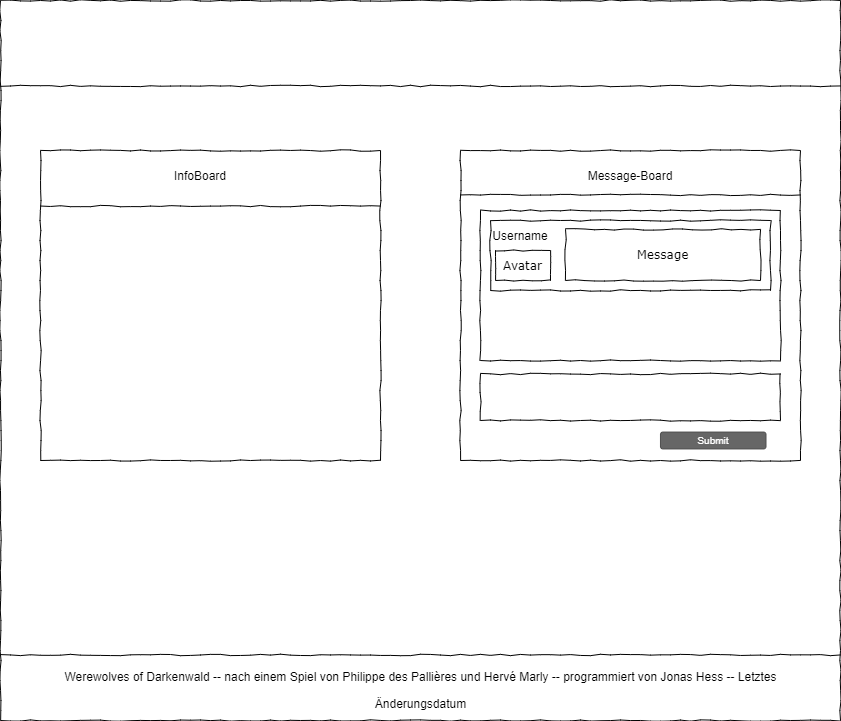

= Werewolves of Darkenwald
:author: Jonas Hess
:email: jonas.a.hess@outlook.com
:revnumber: v1.0
:revdate: 18.12.2021
:figure-caption: Figure

CAUTION: _Alle Rechte zu diesem Spiel liegen bei lûi-meme. Dieses Projekt dient einzig der persönlichen schulischen Bildung und darf nicht kommerziell genutzt werden._

IMPORTANT: Da mir zwei Tage vor Abgabetermin ein Fehler in der Versionierung passierte, musste ich den grössten Teil des Programms in einer Nachtschicht neu schreiben. Aus diesem Grund wurde sich auf das wesentliche konzentriert und im Programm ist nur ein Forum enthalten.

== Grundidee
Das Programm wird eine Implementierung des Spiels Werwölfe von Düsterwald. Die Mitspieler stellen die Bevölkerung eines kleinen Dorfes dar. Ein kleiner Teil der Bevölkerung besteht aus Werwölfen, die während jeder Spielrunde einen Dorfbewohner fressen, dieser scheidet aus dem Spiel aus. Die Dorfbewohner müssen nun herausfinden, wer alles ein Werwolf ist. Kommt die Dorfgemeinschaft zum Schluss, dass eine Person ein Werwolf sei, wird diese verbrannt und scheidet ebenfalls aus dem Spiel aus. Die Dorfbewohner haben gewonnen, wenn alle Werwölfe verbrannt wurden. Die Werwölfe haben gewonnen, wenn sie die Mehrheit des Dorfes stellen.

Das Spiel läuft rundenbasiert und in Echtzeit ab. Dabei gibt es einen Tag- und Nachtzyklus von 8:00 bis 20:00. Den Spielern steht ein Diskussionsforum zur Verfügung, sowie ein Steckbrief zur eigenen Person und ein Notizblock. Bis 20:00 muss über ein Dropdown abgestimmt werden, wer ein Werwolf sei. Dann wird die Person mit den meisten Stimmen verbrannt. Die Werwölfe haben ein eigenes Forum, dass nur sie sehen, um sich in der Nacht absprechen zu können.

Die Siegesbedingungen werden jeweils morgens und abends geprüft.

In einer ersten Iteration wird es nur Werwölfe und Dorfbewohner geben. Verschiedene Rollen kommen später dazu.

== Planung
=== Use-Cases
Bei den Use-Cases wird zwischen der User-Verwaltung und der Spieloberfläche unterschieden.

=== Relationales Datenmodel

=== Ablauf Anmeldung und Registrierung

=== ERM der Datenbank

=== Klassendiagramm

=== Wireframes

